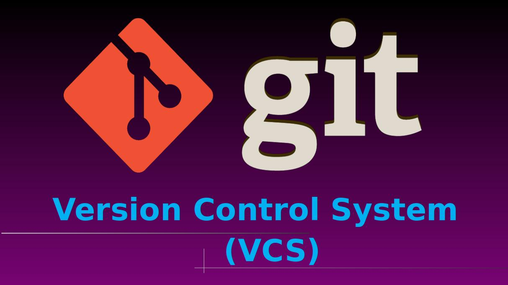
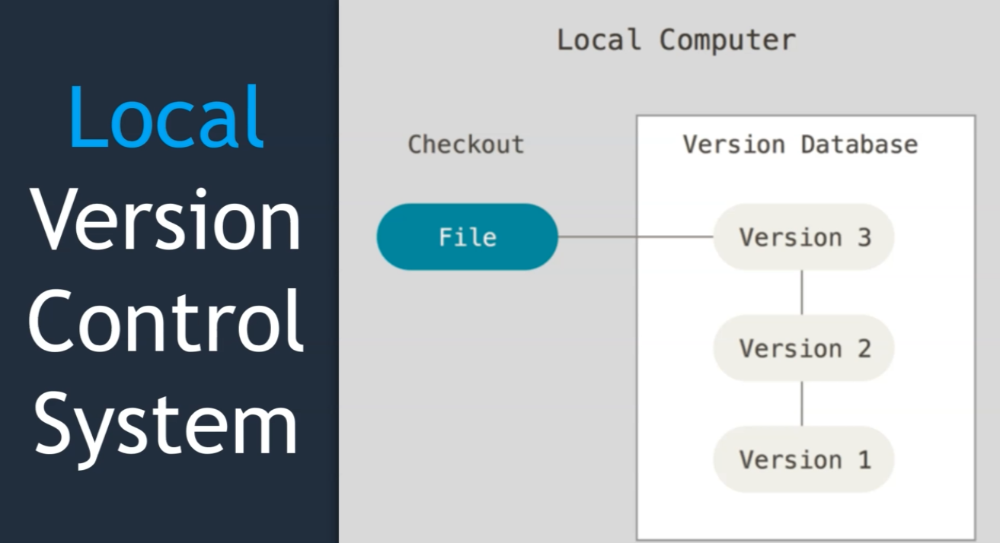
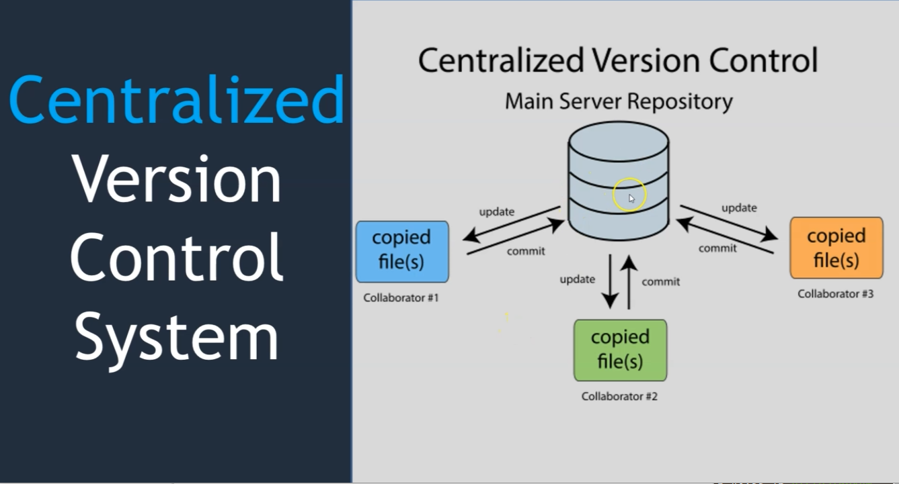
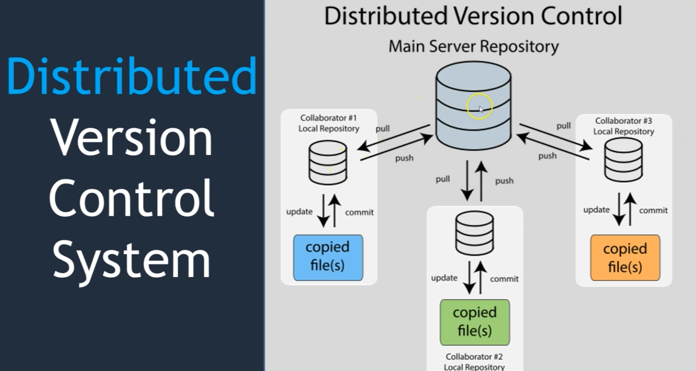
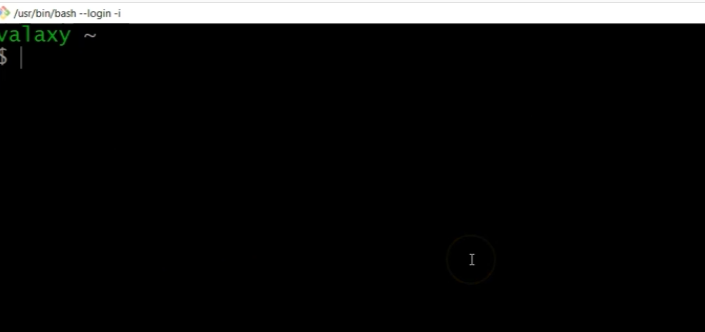

## Módulo 1: Git y la Línea de Comandos ¡Manos a la obra!

* Introducción a Git y su uso en la línea de comandos.
* Instalación de Git y configuración.
* Uso de opciones y argumentos de comandos.
* Configuración del entorno y editor de texto.

**Proporción Teoría/Práctica por Sección:** 20%/80%

Este módulo es tu viaje inaugural al fascinante mundo de Git a través de la línea de comandos. Olvida imágenes abstractas y complejas explicaciones; aquí lo abordaremos con un enfoque práctico, recuerda que la metodología a seguir es 20% teoría, 80% práctica ¡y vamos por ello!


### 1.1 Introducción a Git y la Línea de Comandos: El Primer Encuentro

Git es como un súper héroe que guarda todos los cambios de tu proyecto, ¡como si tuviera una máquina del tiempo para el código!

- Te permite volver a versiones anteriores
- Colaborar en equipo con un flujo de trabajo de forma ordenada
- Mantener la cordura en proyectos grandes
- Llevar un registro de tus cambios realizados al código
- Permite conocer quien y cuando realizó un cambio
- Permite deshacer cualquier cambio

Ahora también tenemos 3 tipos de control de versiones:

1. Local

2. Centralizado

3. Distribuido



Por otro lado, la línea de comandos es tu herramienta secreta para comunicarte con GIT entre otros. Puede parecer intimidante al principio, pero, ¡tranquilo/a!, es más sencillo de lo que crees. Es como un chat con tu ordenador; le das órdenes y él las ejecuta.



**Desarrollo**

**Paso 1: Instalación de Git:**  Si no lo tienes ya instalado, ve a [https://git-scm.com/downloads](https://git-scm.com/downloads) y descarga la versión para tu sistema operativo. Sigue las instrucciones de instalación, ¡es super sencillo!

**Paso 2: Versión de Git:**  Abre tu terminal (o Git Bash en Windows) y escribe:


```bash
git --version
```

Recuerda presionar la tecla ENTER al final. ¡Debes ver la versión de Git instalada! Si no, revisa la instalación.

**Paso 3: Configuración Inicial (Nombre y Email):**  Git necesita saber quién eres. Configura tu nombre y email:

```bash
git config --global user.name "Tu Nombre"
git config --global user.email "tu.correo@ejemplo.com"
```

Reemplaza `"Tu Nombre"` y `"tu.correo@ejemplo.com"` con tus datos. ¡No te olvides de las comillas!


### 1.2 Navegando por el Sistema de Archivos: Un Viaje Exploratorio

Tu sistema de archivos es como un laberinto de carpetas y archivos.  La línea de comandos te permite navegar por este laberinto usando comandos como `pwd` (para saber dónde estás) y `cd` (para moverte).

**Desarrollo**

**Paso 1: `pwd` (Print Working Directory):** Abre tu terminal y escribe `pwd`.  Este comando te mostrará la ruta completa del directorio en el que te encuentras actualmente.  Es como un GPS para tu sistema de archivos.

**Paso 2: `cd` (Change Directory):** Vamos a crear un directorio llamado "MiProyectoGit" y a movernos a él:

```bash
mkdir MiProyectoGit
cd MiProyectoGit
```

`mkdir` crea la carpeta, `cd` te lleva dentro.  Ahora, si escribes `pwd` de nuevo; ¡debería mostrar la ruta completa a "MiProyectoGit"!

```bash
pwd
```


**Paso 3: Volver atrás:**  Para salir de "MiProyectoGit" y volver al directorio anterior, usa:

```bash
cd ..
```

Los dos puntos (`..`) significan "un nivel hacia arriba" en la estructura de directorios.  Prueba `pwd` otra vez. ¡Ya estás en tu ubicación anterior!

**Paso 4: Navegación con rutas:** Intenta navegar a una ruta específica, por ejemplo (si existe en tu sistema):

```bash
cd /Users/TuUsuario/Documentos
```
Reemplaza `/Users/TuUsuario/Documentos` con una ruta que exista en tu sistema.  Si funciona correctamente, al ejecutar `pwd` deberías ver la ruta completa.


### 1.3 Listando Archivos y Directorios: Una Inspección Minuciosa

El comando `ls` es tu lupa digital.  Te permite ver qué hay dentro de un directorio.  Tiene opciones adicionales; la opción `-a` muestra también los archivos y carpetas ocultas (los que suelen comenzar con un punto "."). ¡Cuidado con ellos! No los borres a menos que sepas que son inofensivos.

**Desarrollo**

**Paso 1: `ls` (List):** Dentro de "MiProyectoGit", escribe `ls`.  Si no has creado ningún archivo, no verás nada.  ¡Genial, por ahora está vacío!

```bash
ls
```

**Paso 2: Crear un archivo:** Crea un archivo de texto simple llamado `readme.txt` con un editor de texto (como nano, vim, notepad++, etc.). ¡En este archivo puedes agregar el texto que desees!

**Paso 3: `ls` de nuevo:** Escribe `ls` otra vez. ¡Ahora deberías ver `README.txt` en la lista!

**Paso 4: `ls -a` (List all):**  Finalmente, escribe `ls -a`.  Verás todos los archivos, incluyendo los ocultos (si los hay).

```bash
ls -a
```

**Paso 5 (opcional: `ls -lF` (List Long):**  Si deseas ver la lista de archivos incluyendo nombre, tamaño, fecha agregas la opción `-l` que indica formato largo o extendido y la opción `-F` es para decorar algunos archivos con marcas especiales como archivos ejecutables o directorios.

```bash
ls -lF
```


### 1.4 Creando y Borrando Directorios: ¡Un poco de orden!

Para crear directorios usamos `mkdir` (make directory), y para eliminarlos (con precaución) usamos `rmdir` (remove directory), pero solo funciona si el directorio está vacío.  Para directorios que NO están vacíos, se debe usar `rm -rf` (remove recursive force), pero con mucha precaución,  pues borra TODO su contenido sin posibilidad de recuperación.

**Desarrollo**

**Paso 1: `mkdir` (Make Directory):** Crea dos nuevos directorios dentro de "MiProyectoGit":

```bash
mkdir src
mkdir docs
```

Ahora, si escribes `ls`, verás "src" y "docs".

**Paso 2: `rmdir` (Remove Directory):**  Crea un archivo vacío en `docs` (por ejemplo, `ejemplo.txt`). Luego, intenta borrar "docs" con `rmdir docs`. ¡Recibirás un error porque "docs" no está vacío!

```bash
rmdir docs
```

**Paso 3: Borrar "src" (Vacío):** Ahora borra "src" con `rmdir src`.  ¡Listo!

```bash
rmdir src
```

**Paso 4: Borrar "docs" (NO vacío) con precaución:** Para borrar "docs" (que contiene `ejemplo.txt`) debes eliminar su contenido primero, utilizando `rm` (remove) :

```bash
rm docs/ejemplo.txt
rmdir docs
```

o, la opción más drástica (usa con cuidado extremo):

```bash
rm -rf docs
```

**IMPORTANTE:** `rm -rf` es MUY poderoso, ¡así que asegúrate de usar la ruta correcta!  Una vez que usas `rm -rf` no hay vuelta atrás.


Recuerda guardar tu trabajo antes de proceder con los comandos `rm` y `rmdir`.

Este módulo sienta las bases para el resto de tu viaje Git. ¡Sigue practicando y dominarás la línea de comandos!

