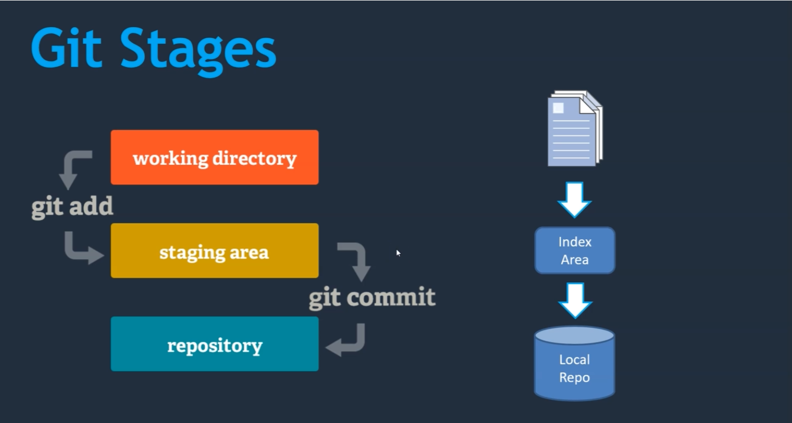

## Módulo 2: Repositorios Locales - ¡Domina tu propio universo Git!

* Configuración actual y creación de repositorios locales.
* Introducción a áreas de Git y adición de archivos.

En este módulo, profundizaremos en el corazón de Git: **los repositorios locales**. Aprenderemos a crearlos y a entender sus componentes clave.


### 2.1 Configuración Actual y Creación de Repositorios Locales: *¡El Nacimiento de un Repo!*

Un repositorio local es como una cápsula del tiempo para tu proyecto.  Guarda la historia completa de tus cambios, permitiéndote viajar en el tiempo para recuperar versiones anteriores, ¡ideal para deshacer esos cambios por "accidente"!  Para crear un repositorio local, simplemente necesitas decirle a Git que inicie uno en el directorio de tu proyecto. El comando mágico es `git init`.


**Desarrollo**

**Paso 0: Preparación del Terreno:**  Asegúrate de tener tu terminal abierta (git-bash en windows), después vamos a crear una carpeta para trabajar todas las prácticas del curso y la llamaremos `curso-git` y nos cambiamos a esa carpeta.

```bash
mkdir curso-git
cd curso-git
```

Ahora vamos a crear una carpeta para nuestro primer proyecto **demo 2** y nuevamente nos cambiamos a la carpeta del proyecto:

```bash
mkdir demo2-prj
cd demo2-prj
```

Así que ahora debemos de estar situados en el directorio `demo2_prj`. Si usáramos el comando `pwd`obtendríamos la ruta absoluta similar a la siguiente en windows `/Users/TuUsuario/curso-git/demo2-prj`.


**Paso 1: Inicializando el repositorio ( ¡La magia sucede! ):** Ejecuta este comando:

```bash
git init
```

Este comando creará un directorio oculto llamado `.git` dentro de `demo2-prj`.  Este directorio contiene toda la información de tu repositorio. ¡No lo toques!  Es un lugar mágico y misterioso que Git usa internamente y es donde se almacena los registros del control de versiones de manera local.


**Paso 2: Comprobar la creación del repositorio:**  Para ver que todo salió bien, utiliza tu explorador de archivos.  Habilita la opción de mostrar archivos ocultos.  Dentro de tu carpeta `demo2-prj` deberías ver la carpeta `.git`.  Si la ves, ¡felicidades, has creado tu primer repositorio! Si no la ves, revisa la configuración de mostrar archivos ocultos en tu explorador.  Si aun asi no la ves, verifica que hayas ejecutado el comando `git init` correctamente y en la carpeta correcta.

**Pregunta: Confirmación en la terminal:** ¿Qué comando podrías usar para comprobrar que realmente existe la carpeta `.git` dentro de la carpeta `demo2-prj`?


### 2.2 Introducción a las Áreas de Git y Adición de Archivos: ¡Organizando el Caos Creativo!

Git tiene varias zonas de trabajo. Es como tener un tablero de dibujo donde se organiza la información:

* **Directorio de trabajo:** Es tu espacio creativo, donde editas tus archivos.
* **Área de preparación (Staging Area):** Es tu zona de preparación, donde seleccionas qué cambios enviar al siguiente commit.
* **Repositorio local:** Es tu almacén de versiones, donde se guardan las versiones del proyecto (commits).
* **Historial de commits:** Es tu diario de viaje, donde se guarda la evolución del proyecto.

Para añadir archivos a tu repositorio, primero debes agregarlos al área de preparación y luego realizar un commit.


**Desarrollo**

**Paso 1: Crea el archivo `colores.md`:** Crea y abre el archivo `colores.md` con tu editor de texto favorito en la carpeta `demo2-prj` y agrega una nueva línea, por ejemplo:

```markdown
Verde es mi color favorito
```

Guarda los cambios.  Ahora, tu archivo `colores.md` ha sido modificado. En el diagrama de Git se encuentra en el directorio de trabajo.

**Paso 2: Verificar los cambios con `git status`:** Ejecuta este comando:

```bash
git status
```


Verás que Git te indica que hay cambios en el archivo `colores.md`, pero que aún no están en el área de preparación. Esto se indica como "Cambios no rastreados" en el estado de tu repositorio.

**Paso 3: Agregar a la zona de preparación (`git add`):**  Ahora, agregamos los cambios al área de preparación:

```bash
git add colores.md
```

Ejecuta `git status` de nuevo.  Verás que ahora el archivo `colores.md` está listo para un commit.  ¡Está en el área de preparación!


**Paso 4: El Primer Commit (¡Guardando la Historia!):**  Finalmente, guardamos los cambios en el historial de commits.

```bash
git commit -m "Añadiendo mi color favorito"
```

`-m` agrega un mensaje de commit (¡siempre añade mensajes descriptivos!).

Y si ejecutamos `git status` nuevamente veríamos un mensaje de que el área de trabajo está limpia y es el estado ideal de un repo.


**Paso 5: Verificando el Historial con `git log`:**  Para ver tu nuevo commit, usa:

```bash
git log
```

Verás un resumen de tu primer commit, incluyendo el hash de commit.


¡Felicidades! Has creado tu primer commit.  En este módulo has aprendido a crear un repositorio local y a manejar archivos. 
