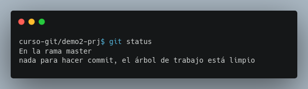

## Módulo 3: Realizando Commits - ¡Capturando Instantes en el Tiempo!

* Motivos para hacer commits y el proceso de dos pasos.
* Visualización de commits.

Este módulo se centra en la piedra angular de Git, el **commit** (confirmación o registro). Aprenderemos por qué son importantes, cómo realizarlos correctamente y cómo visualizar su historial.


### 3.1 Motivos para Hacer Commits y el Proceso de Dos Pasos: ¡Organización y Respaldo!

Los commits son como instantáneas de tu proyecto.  Cada commit guarda el estado de tus archivos en un momento específico.  ¿Por qué son importantes?  Por varias razones:

* **Historia:** Si algo sale mal, siempre puedes volver a una versión anterior.
* **Colaboración:** Facilita el trabajo en equipo, ya que todos pueden ver y trabajar con las diferentes versiones del proyecto.
* **Organización:**  Divide el desarrollo en partes manejables, haciendo más fácil la gestión y comprensión del progreso.
* **Seguimiento de Cambios:** Permite rastrear la evolución del proyecto, viendo qué se ha modificado y cuándo.

El proceso de realizar un commit consta de dos pasos principales:

1. **Preparación (Staging):** Seleccionas qué archivos o cambios quieres incluir en este commit específico.
2. **Commit:** Guardas la instantánea con un mensaje descriptivo.


**Desarrollo**

**Paso 0: Preparación:** Asegúrate de tener tu terminal abierta en el directorio `demo2-prj` y que cuentas con el archivo `colores.md` desde el módulo anterior.

**Paso 1: `git status` (Comprobando el terreno):** Antes de hacer cualquier cosa, siempre es buena idea usar `git status`:

```bash
git status
```



Esto te mostrará el estado actual de tu repositorio, indicando qué archivos han sido modificados pero aún no están preparados para el commit o si el repositorio está en estado limpio.


**Paso 2: Añadiendo al área de preparación (`git add`):**  Ahora, agregamos una nueva línea al archivo `colores.md`

```
Blanco es la suma de colore
```

y agregamos las modificaciones al área de preparación:

```bash
git add colores.md
```

**Nota::** Si tuvieras varios archivos modificados, podrías agregarlos individualmente o usar `git add -A` o `git add .` para agregar todos los archivos modificados.


**Paso 3: `git status` (Comprobación después del `add`):** Verifica de nuevo con `git status`.  Ahora deberías ver que `colores.md` está listo para ser confirmado (¡comiteado!)

**Paso 4: El Commit (¡A guardar!):**  Finalmente, ¡el commit!

```bash
git commit -m "Añadiendo el color blanco"
```

**Paso 5: Verificando con `git log`:**  Para comprobar si el commit se realizó correctamente, usa `git log`:

```bash
git log
```

Debes ver la información del commit: hash, autor, fecha y hora, y el mensaje.


### 3.2 Visualización de Commits: ¡Viajando a través del tiempo!

El historial de commits es la línea de tiempo de tu proyecto. Puedes usar el comando `git log` para ver todos los commits realizados, en orden inverso cronológico.  Cada commit tiene un hash único (un código alfanumérico largo) que te permite identificarlo.  Además, `git log` muestra información útil: quién realizó el commit, cuándo y qué cambios incluía (a través del mensaje del commit).


**Desarrollo**

**Paso 1:  `git log` (La Línea del Tiempo):**  En tu terminal, escribe `git log`:

```bash
git log
```


Este comando mostrará una lista de tus commits.  Como solo has realizado dos commits hasta ahora, la lista será corta.


**Paso 2:  Ampliando la información con opciones de `git log`:** El comando `git log` ofrece muchas opciones. Por ejemplo, para mostrar una vista más compacta, puedes utilizar `git log --oneline`:

```bash
git log --oneline
```

Esto mostrará cada commit en una sola línea.

**Paso 3: Añadiendo más commits:** Para practicar, realiza más commits.  Modifica `colores.md` (por ejemplo, añadiendo "Amarillo es el tercer color del arcoíris"), añade los cambios al área de preparación (`git add colores.md`) y realiza un nuevo commit (`git commit -m "Añadiendo amarillo"`). Repite este proceso con otro color más.

**Paso 4: `git log` nuevamente:** Ejecuta `git log` de nuevo. ¡Verás ahora una lista más larga, reflejando tus nuevos commits! Si la salida es demasiado larga para la pantalla, utiliza las flechas arriba y abajo para navegar o `q` para salir de la vista.

**Paso 5: `git log --oneline` nuevamente:** Ejecuta `git log --oneline` de nuevo. Deberías de poder ver toda la lista de confirmaciones en la misma ventana.


**Paso 6:  Explorando un commit específico:**  Puedes ver la información de un commit específico usando su hash (o parte del mismo). Por ejemplo, si el hash de tu primer commit es `a1ade96...`, puedes usar:

```bash
git show a1ade96
```

Reemplaza `a1ade96` con el hash de tu commit.


**Paso 7 (opcional):  Explorando un archivo específico:**  Puedes ver la información de un archivo específico usando el comando `git annotate <archivo>`. Por ejemplo, para ver todos los cambios del archivo `colores.md` usamos:

```bash
git annotate colores.md
```


Este módulo te ha dado una comprensión más profunda de los commits, su importancia y cómo visualizar su historial.

