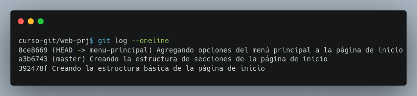

## Módulo 4: Ramas - ¡Multiverso Git: Trabaja en Paralelo!

- Uso y creación de ramas.
- Manejo de HEAD y cambio entre ramas.

Este módulo desvela el poder de las ramas en Git: la clave para trabajar en paralelo en tu proyecto, **experimentar sin miedo** y colaborar eficientemente.


### 4.1 Uso y Creación de Ramas: ¡Multiplicando tus posibilidades!

Las ramas en Git son como líneas de desarrollo paralelas.  Te permiten trabajar en nuevas características o correcciones de errores sin afectar la rama principal (normalmente llamada `master` o `main`).  Imagina que es como tener varias versiones de tu proyecto funcionando simultáneamente. Puedes experimentar en una rama sin riesgo de romper la versión estable. Una vez que estás satisfecho con los cambios, puedes integrarlos a la rama principal mediante una fusión (*merge*).


**Desarrollo**

**Paso 0: Preparación:**  Asegúrate de tener tu terminal abierta y ahora vamos a trabajar en el proyecto `web-prj`, así que realiza las siguientes tareas hasta tener el repo (repositorio) con varias confirmaciones en la rama `master` y un commit la rama `menu-principal`.

- Crea la carpeta `web-prj`
- Inicializar el repo con `git init`
- Crear el archivo `index.html` con la estructura básica de una página web pero sin contenido.
- Crea una confirmación del archivo `index.html`
- Agrega la secciones de encabezado, contenido y pié al archivo `index.html` y crea un commit.
- Crea la rama `menu-principal` con el comando `git checkup -b menu-principal`
- Agrega el código del menú principal en la sección de encabezado y crea una confirmación.

Una revisión rápida usando `git log --oneline` debería mostrar 3 commits y dos ramas.



Por si fuera necesario, a continuación está todo el código HTML que debería contener el archivo `index.html`, puedes usarlo para ir copiando el código que necesites para cada confirmación.

```html
<!DOCTPYE html>
<html>
<head>
	<title>Trabajando con GIT:: Inicio</title>
</head>
<body>
	<header>
		<a href="index.html">Inicio</a> |
		<a href="temario.html">Temario</a> |
		<a href="quienes-somos.html">Quienes somos</a>
	</header>
	<div class="contenido">
		
	</div>
	<footer>
		
	</footer>
</body>
</html>
```

**Paso 1: Listando ramas (`git branch`):**  Primero, veamos qué ramas existen usando:

```bash
git branch
```

Verás una lista de tus ramas, con un asterisco (*) indicando la rama actual (en la que te encuentras).


**Paso 2: Creando una nueva rama (`git branch <nombre_rama>`):**  Vamos a crear una nueva rama llamada `pie-de-index`:

```bash
git branch pie-de-index
```

Este comando crea una nueva rama, pero **no** cambias a ella.  La nueva rama parte desde el commit en el que te encuentras actualmente.

**Paso 3: Verificando las ramas (`git branch` de nuevo):** Ejecuta `git branch` de nuevo. Ahora deberías ver la nueva rama `pie-de-index` en la lista.


**Paso 4: Cambiar a la nueva rama (`git switch <nombre_rama>`):** Para comenzar a trabajar en la nueva rama, debemos cambiarnos a ella:

```bash
git switch pie-de-index
```

**Paso 5: Confirmación con `git status`:** Para confirmar que te encuentras en la nueva rama, usa `git status`.


**Paso 6: Creando un commit en la nueva rama:** Agrega el contenido del pié de la página de inicio, haz un `git add index.html` y luego `git commit -m "Añadiendo pié de página a index.html"`.

A continuación el código HTML que se tendría que agregar, considera que las etiquetas `<footer>` ya existen.

```html
	<footer>
		© All rights reserved. The Inventor's House, 2024.
		<a href="https://theinventorhouse.org/">
			theinventorhouse.org
		</a>
	</footer>
```

**Paso 7: Verificar con `git log`:** Usa `git log` para ver la estructura de commits y como se relaciona la nueva rama con la rama `master`. Observa cómo cada rama apunta a una línea diferente de commits.


### 4.2 Manejo de HEAD y Cambio entre Ramas: ¡Saltando entre universos!

`HEAD` es un puntero que indica en qué rama te encuentras actualmente.  Cuando cambias de rama con `git switch`, `HEAD` se mueve a la nueva rama.  Esto es crucial porque cualquier cambio que realices se aplicará a la rama a la que apunta `HEAD`.

**Desarrollo**

**Paso 1: Verificando HEAD con `git branch`:**  Usando `git branch`, comprueba en qué rama te encuentras actualmente (deberías estar en `pie-de-index`). El asterisco (*) indicará la rama activa.

**Paso 2: Verificando HEAD con `git log`:**  Puedes ver también a qué rama apunta `HEAD` usando `git log`. Busca la línea `HEAD -> pie-de-index`. (Si estuvieras en la rama `menu-principal`, verías `HEAD -> menu-principal`).

**Paso 3: Cambiando de rama (`git switch`):**  Vamos a cambiar de nuevo a la rama `menu-principal`:

```bash
git switch menu-principal
```

**Paso 4: Comprobar HEAD con `git branch` y `git log`:** Verifica con `git branch` y `git log` que `HEAD` ahora apunta a la rama `menu-principal`.

¿Podrías observar algo extraño en la lista de commits?

**Paso 5:  Creando un nuevo commit en la rama `menu-principal`:**  Agrega la opción de **Contacto** al menú principal de la página de inicio, en `index.html`, utiliza `git add index.html` y `git commit -m "Añadiendo Contacto al menú principal en página de inicio"`.  Observa como al ejecutar `git log`, el nuevo commit solo se encuentra en la rama `menu-principal`.


El código HTML del menú principal queda como el siguiente:

```html
	<header>
		<a href="index.html">Inicio</a> |
		<a href="temario.html">Temario</a> |
		<a href="quienes-somos.html">Quienes somos</a>
		<a href="contacto.html">Contacto</a>
	</header>
```

**Paso 6: Cambiar a `master` y verificar el historial:** Cambiar de regreso a la rama `master` con `git switch master` y vuelve a ejecutar `git log`.  Observa como este nuevo commit solo es visible en la rama `menu-principal`.


**Paso 7:  Explorando HEAD:**  El archivo `HEAD` en el directorio `.git/` contiene la información de la rama actual (`refs/heads/<nombre_de_la_rama>`). Abre el archivo `HEAD` con un editor de texto para ver el puntero actual.


Este módulo te ha proporcionado una comprensión sólida de las ramas y cómo usarlas en tus proyectos de Git.

Recuerda que las ramas son una parte fundamental de Git, y al dominarlas tendrás un mejor control sobre tus proyectos.  ¡No tengas miedo de experimentar y crear nuevas ramas para desarrollar diferentes funcionalidades!

