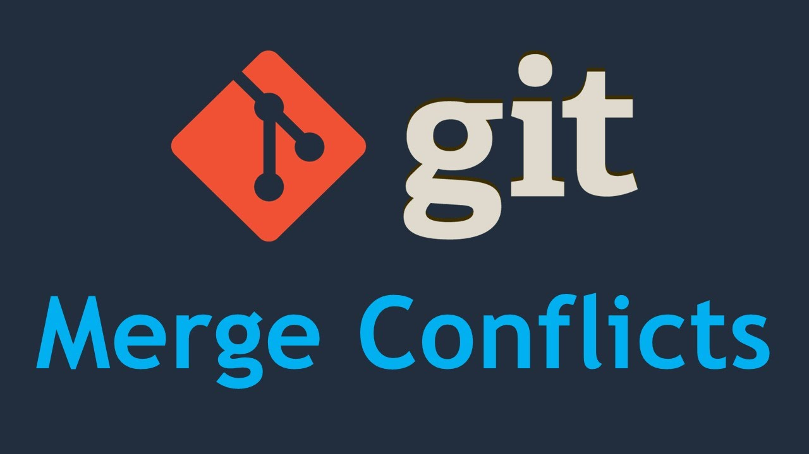
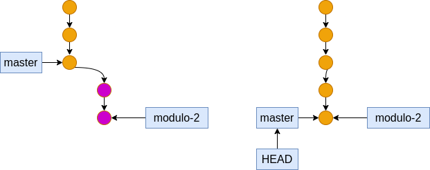
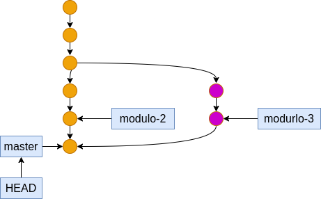
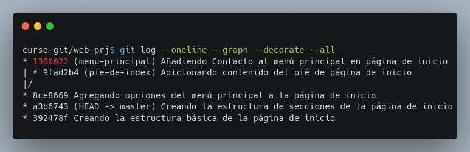
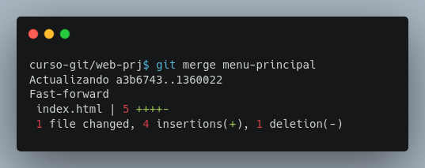
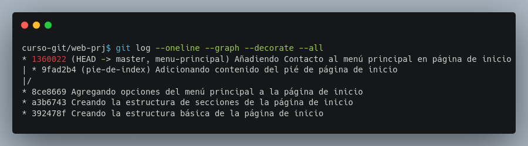
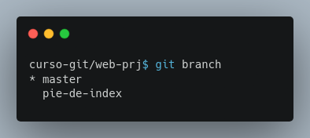

## Módulo 5: Fusión (Merging) - ¡Uniendo Caminos en tu Multiverso Git!

- Introducción a la fusión y tipos de fusiones.
- Realización de una fusión Fast-Forward y manejo de ramas.

Este módulo te guiará por el arte de la fusión (*merging*) en Git, una técnica esencial para integrar cambios de diferentes ramas. Aprenderemos los tipos de fusiones y practicaremos una fusión *fast-forward*.

### 5.1 Introducción a la Fusión y Tipos de Fusiones: ¡Unir caminos!

La fusión es el proceso de integrar los cambios de una rama (la rama de origen) en otra rama (la rama de destino).  Piensa en ello como unir dos líneas de desarrollo en una sola.  Es una operación fundamental para la colaboración y la gestión eficiente de proyectos.

Existen dos tipos principales de fusiones:

* **Fusión *Fast-Forward*:**  Es la fusión más sencilla. Ocurre cuando el historial de la rama de destino es una subsecuencia del historial de la rama de origen (es decir, la rama de destino no tiene commits que no estén también en la rama de origen).  En este caso, Git simplemente mueve el puntero de la rama de destino hacia adelante al último commit de la rama de origen.  ¡Como si fuera un atajo en el tiempo!




* **Fusión de Tres Vías:** Esta fusión es más compleja y se usa cuando las ramas han divergido (tienen commits que no son comunes a ambas).  Git necesita comparar cuidadosamente los cambios de ambas ramas y crear un nuevo commit, llamado *commit de fusión*, que combina los cambios.  Imagina que es como unir dos ríos, creando un nuevo cauce que los combina.




**Desarrollo**

**Paso 0: Preparación:**  Debes tener tu terminal abierta en el directorio `web-prj`, con las ramas `master`, `menu-principal` y `pie-de-index` como se dejó en el Módulo 4. Asegúrate de estar en la rama `master`.

**Paso 1: Visualizando el Historial (`git log --graph --oneline --decorate`):**  Para una mejor visualización, utiliza este comando:

```bash
git log --graph --oneline --decorate --all
```



La opción `--graph` muestra un gráfico del historial de commits, `--oneline` lo muestra de forma compacta y `--decorate` añade nombres de rama y `--all` muestra la información de todas las ramas.  Esto te ayudará a visualizar la relación entre las ramas y sus commits. Observa que la rama `menu-principal` ha divergido de la rama `pie-de-index`.

**Paso 2:  Identificación del tipo de fusión:** Observa el gráfico generado por `git log`.  Si la rama `menu-principal` se puede alcanzar siguiendo la línea de commits de la rama `master` sin bifurcaciones, entonces es una fusión *fast-forward*.


### 5.2 Realizando una Fusión Fast-Forward y Manejo de Ramas: ¡El Arte de la Integración!

La fusión *fast-forward* es el tipo de fusión más simple y eficiente.  Como ya sabes, se usa cuando el historial de la rama de destino es una subsecuencia del historial de la rama de origen.  Para realizar una fusión *fast-forward*,  debes:

1. Estar en la rama de destino.
2. Usar el comando `git merge <nombre_de_la_rama_origen>`.


**Desarrollo**

**Paso 1: Asegurarse de estar en la rama de destino:** Verifica con `git branch` que te encuentras en la rama `master` (deberías estarlo).

**Paso 2: Realizando la fusión (`git merge`):**  Ahora, fusionemos la rama `menu-principal` en la rama `master`:

```bash
git merge menu-principal
```


Git detectará automáticamente que es una fusión *fast-forward* y moverá el puntero de la rama `master` al último commit de la rama `menu-principal`.  La salida mostrará "*fast-forward*".

**Paso 3: Verificando el resultado con `git log --graph --oneline --decorate --all`:**  Ejecuta de nuevo este comando para visualizar el resultado de la fusión.  Observa cómo la rama `master` ahora apunta al commit más reciente de la rama `menu-principal`.



**Paso 4: Verificando el archivo (`index.html`):** Abre el archivo `index.html` con tu editor.  Debería contener todas las opciones de menú, pero sin el contenido del pié de página.

**Paso 5: Eliminando la rama `menu-principal` (Opcional):**  Como ya no necesitas la rama `menu-principal`, puedes eliminarla (con cuidado):

```bash
git branch -d menu-principal
```

El `-d`  es para eliminar una rama que ya ha sido fusionada. Si tratas de eliminar una rama que no ha sido fusionada, recibirás un error.  Si quieres forzar la eliminación, usa `-D` (con mucha precaución).


**Paso 6: Verificar las ramas (`git branch`):**  Ejecuta `git branch` para confirmar que la rama `menu-principal` ya no existe.



**Manejo de Ramas (Recomendaciones):**

* **Mantén tus ramas organizadas:**  Crea ramas con nombres descriptivos que reflejen su propósito.
* **Fusiones frecuentes:**  Integra los cambios de las ramas de características a la rama `master` o a la rama designada con regularidad para evitar conflictos.
* **Elimina las ramas:**  Una vez fusionadas, elimina las ramas para mantener el historial limpio y claro.

Este módulo te ha proporcionado las bases para realizar fusiones *fast-forward*.  En próximos módulos, exploraremos fusiones más complejas y el manejo de conflictos.

Recuerda que una correcta gestión de ramas evita problemas a futuro.  Un buen nombre de rama, commits descriptivos y fusiones regulares son clave para un flujo de trabajo eficiente en Git.


