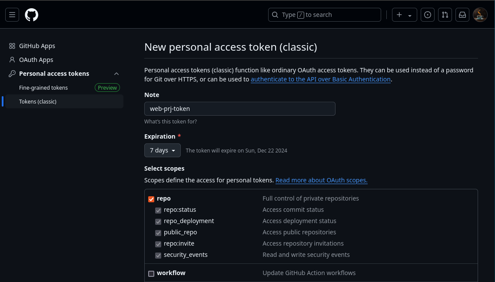
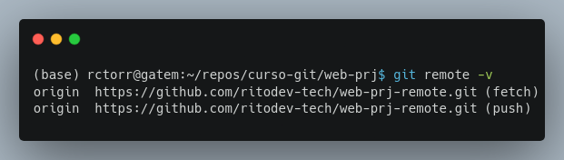
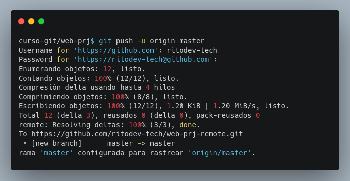
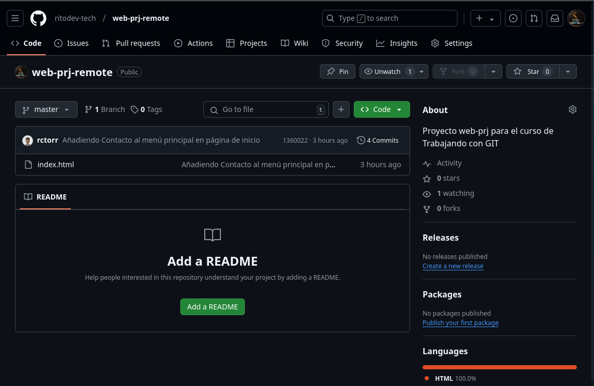
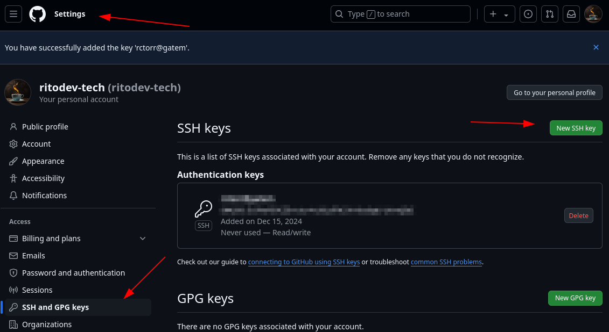
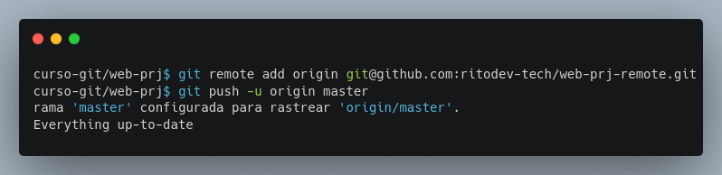

## Módulo 6: Servicios de Hosting y Autenticación - ¡Conectando tu Git al Mundo!

- Configuración de cuentas y credenciales para servicios de hosting y repositorios remotos.

Este módulo te adentrará en el mundo de los repositorios remotos. Aprenderás a configurar tu cuenta en un servicio de hosting (como GitHub, GitLab o Bitbucket) y a configurar las credenciales necesarias para conectar tu repositorio local con el remoto, utilizando HTTPS o SSH.

### 6.1 Configuración de Cuentas y Credenciales para Servicios de Hosting y Repositorios Remotos: ¡Tu Pasaporte al Mundo Git Remoto!

Hasta ahora, hemos trabajado solo con repositorios locales. Pero el verdadero poder de Git se despliega al colaborar con otros y compartir tu código.  Para ello, necesitamos un servicio de hosting (como GitHub, GitLab o Bitbucket) que almacene una copia de tu repositorio en la nube.  Este repositorio remoto es accesible desde cualquier lugar con conexión a internet.

Para acceder a tu repositorio remoto y realizar operaciones como *push* (subir cambios) y *pull* (bajar cambios), necesitas autenticarte.  Existen dos métodos principales de autenticación:

* **HTTPS:** Usa un nombre de usuario y una contraseña (o un token de acceso personal, según el servicio).  Es el método más sencillo de configurar, pero menos seguro que SSH.

* **SSH:** Utiliza un par de claves (pública y privada) para autenticación.  Es el método más seguro, pero requiere una configuración inicial un poco más compleja.


**Desarrollo**

**Paso 1: Elige tu servicio de hosting:**  Para este ejemplo, usaremos GitHub.  Crea una cuenta si aún no la tienes ([https://github.com/join](https://github.com/join)).

**Paso 2: Generar una credencial de autenticación (HTTPS):**  GitHub (y Bitbucket) ya no permiten la autenticación directa con tu contraseña de cuenta para repositorios remotos. Necesitas generar un *Personal Access Token*:

1. Inicia sesión en tu cuenta de GitHub.
2. Ve a "Settings" -> "Developer settings" -> "Personal access tokens".
3. Haz clic en "Generate new token".
4. Dale un nombre descriptivo a tu token (ej. "web-proj-token").
5. Selecciona los permisos necesarios para tu token.  Para este ejemplo, selecciona al menos "repo" (para acceder a tus repositorios).

**¡IMPORTANTE!**  Anota este token en un lugar seguro, ya que no podrás verlo de nuevo una vez generado.



**Paso 3: Configurando tu repositorio local con la credencial HTTPS:**  Ahora, necesitamos decirle a Git cómo autenticarse con GitHub. Usaremos el comando `git remote set-url`. Primero, necesitas crear el repositorio remoto en GitHub.

* **Crear el repositorio en GitHub:**  En la página principal de GitHub, haz clic en el botón "+", luego en "New repository". Dale un nombre a tu repositorio (ej. "web-prj-remote").  Puedes elegir si quieres inicializarlo con un archivo README.  Para este tutorial, es mejor no inicializarlo. Haz clic en "Create repository".
* **Obtener la URL HTTPS:** En la página de tu nuevo repositorio, encontrarás la URL HTTPS del repositorio. La URL tendrá la forma de:  `https://github.com/<tu_usuario>/<nombre_de_tu_repositorio>.git`

Ahora, en tu terminal, configura la URL remota:

```bash
git remote add origin https://github.com/<tu_usuario>/<nombre_de_tu_repositorio>.git
```

Reemplaza `<tu_usuario>` y `<nombre_de_tu_repositorio>` con tus datos.


**Paso 4:  Verificando la configuración:**  Puedes verificar la URL remota con:

```bash
git remote -v
```



Verás las URL de *fetch* y *push* para tu repositorio remoto.

**Paso 5: Envio (`push`) de tu repositorio local al remoto:**  Ahora, sube tu repositorio local a GitHub:

```bash
git push -u origin master
```

El `-u` configura la rama `master` como la rama de seguimiento por defecto.  Te pedirá tu nombre de usuario y contraseña de GitHub.  En lugar de tu contraseña, deberás pegar el *Personal Access Token* que generaste en el paso 2.



Y ahora puedes actualizar la página donde has creado el repo en Github y deberás de observar los archivos de tu repo.




**Paso 6: Generar una credencial de autenticación (SSH):** Si prefieres usar SSH, necesitarás generar un par de claves SSH. Este proceso es similar para macOS, Windows y Linux, pero varía ligeramente en los comandos.

1. **Generar las claves:** El comando base para generar un par de claves SSH es `ssh-keygen`.  Se te pedirán opciones como la ubicación del archivo de la clave y una frase de contraseña (opcional).
2. **Agregar la clave privada al agente SSH:**  Esto dependerá de tu sistema operativo y la configuración del agente SSH.  Busca información específica para tu sistema operativo.
3. **Agregar la clave pública a tu cuenta de GitHub:**  Copia el contenido de tu archivo de clave pública (`~/.ssh/id_rsa.pub`) y pégalo en la sección "SSH Keys" de las "Settings" de tu cuenta de GitHub.



* **Obtener la URL SSH:** En la página de tu nuevo repositorio, encontrarás la URL SSH del repositorio. La URL tendrá la forma de: `git@github.com:<tu_usuario>/<nombre_de_tu_repositorio>.git`

Ahora, en tu terminal, configura la URL remota:

```bash
git remote remove origin
git remote add origin git@github.com:<tu_usuario>/<nombre_de_tu_repositorio>.git
```

Reemplaza `<tu_usuario>` y `<nombre_de_tu_repositorio>` con tus datos.

Ahora, sube tu repositorio local a GitHub de nuevo y ya no debería de solicitarte la clave:

```bash
git push -u origin master
```



Este módulo te ha enseñado a configurar credenciales de autenticación para trabajar con repositorios remotos.  ¡Recuerda mantener tus claves SSH privadas seguras!  En el próximo módulo, finalmente usarás esta configuración para conectar tu repositorio local a un repositorio remoto.
