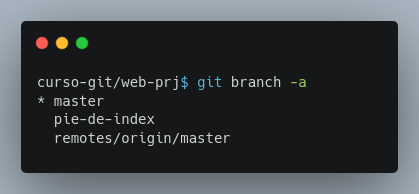
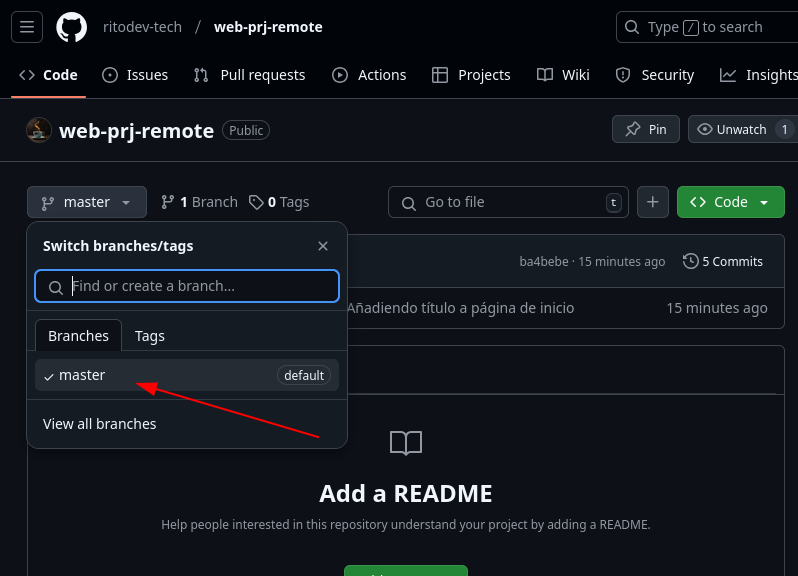
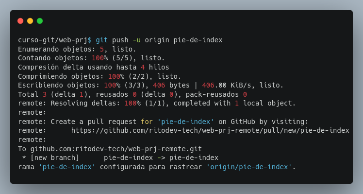
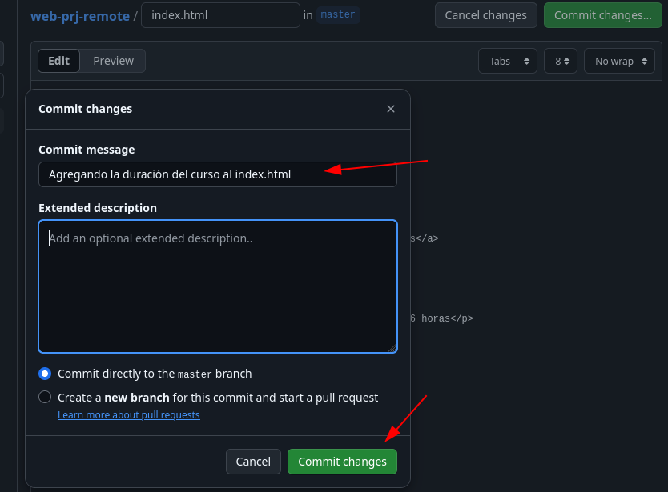
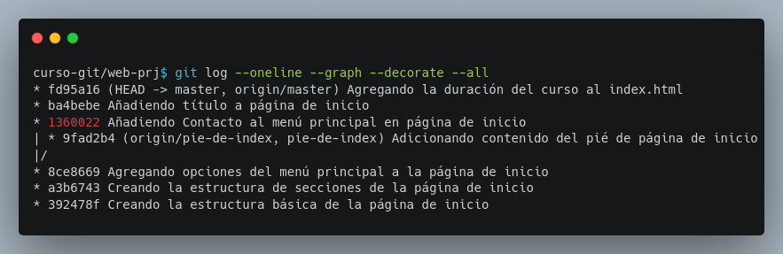

## Módulo 7: Creación y Envío a un Repositorio Remoto - ¡Colaboración Global!

- Interacción entre repositorios locales y remotos.
- Creación de repositorios remotos y trabajo en ellos.

Este módulo te guiará a interactuar desde tu repositorio local y tu repositorio remoto. ¡Prepárate para la colaboración global!


### 7.1 Interacción entre Repositorios Locales y Remotos: ¡Un Puente entre Mundos!

Hasta ahora, hemos trabajado con repositorios locales.  Un repositorio remoto, alojado en un servicio como GitHub, GitLab o Bitbucket, es una copia de tu repositorio en la nube.  La interacción entre tu repositorio local y el remoto no es automática; necesitas usar comandos específicos para sincronizar ambos.  Los comandos clave son:

* `git push`:  Envía (sube) tus commits locales al repositorio remoto.
* `git pull`:  Descarga (baja) los commits del repositorio remoto a tu repositorio local.
* `git clone`: Crea una copia local de un repositorio remoto.
* `git fetch`: Descarga la información del repositorio remoto sin fusionarla con tu repositorio local. Esto es útil para ver los cambios que han ocurrido en el repositorio remoto antes de fusionarlos en tu repositorio local.

Recuerda que los repositorios locales y remotos son independientes.  `git push` y `git pull` son los puentes que los conectan.


**Desarrollo**

**Paso 1: Verificar la conexión remota (`git remote -v`):**  Comprueba que la conexión remota a `web-prj-remote` está correctamente configurada:

```bash
git remote -v
```

Deberías ver la URL de tu repositorio remoto listada, con los nombres `fetch` y `push`.

**Paso 2:  Realizar un nuevo commit local y enviarlo:**  Realiza un nuevo commit en la rama `master` de tu repositorio local

Añade un título a la página de inicio, usa `git add`, `git commit -m "Añadiendo título a página de inicio"` y luego `git push origin master` para enviar el nuevo commit.  Verifica en GitHub que el nuevo commit aparezca.

El código HTML del contenido se muestra a continuación:

```html
	<div class="contenido">
		<h2>Trabajando con GIT</h2>
	</div>
```

**Paso 3: Enviar una rama diferente:** Primero revisa tu lista de ramas locales ahora usando `git branch -a`, donde `-a` mostrará todas las ramas locales y remotas.

```bash
git branch -a
```



Y también en el repo **web-prj-remote** se puede verificar que sólo existe la rama **master**.



Entonces en la terminal nos cambiamos a la rama `git switch pie-de-index` y la envíamos al repositorio remoto (`git push -u origin pie-de-index`).  Verifica en GitHub que la nueva rama y su commit se hayan creado correctamente.



**Paso 4: Descarga las actualizaciones de una rama:** En la página de Github selecciona el archivo `index.html` y da click en el botón de editar y modifica el contenido para que sea similar al siguiente:

```html
	<div class="contenido">
		<h2>Trabajando con GIT</h2>
		<p><strong>Duración del curso:</strong> 16 horas</p>
	</div>
```

y entonces dá click en el botón **Commit changes...** y en el diálogo que aparece escribir el mensaje de la confirmación "Agregando duracción del curso en la página de inicio"



Para obtener los cambios realizados por terceros ejecuta el comando `git pull` desde la terminal estando en la rama `master` y entonces revisa el contenido del archivo `index.html` debería de contener los cambios realizados desde la página de Github.


```bash
git switch master
git pull
```


### 7.2 Creación de Repositorios Remotos y Trabajo en Ellos: ¡Colaboración en la Nube!

**(20% Teoría)** Crear un repositorio remoto es la primera parte del proceso para colaborar usando Git.  En la práctica, puedes crear un repositorio remoto directamente a través de la interfaz web de tu servicio de hosting (como GitHub), o utilizando el comando `git init` seguido de `git remote add` y `git push`.  En este módulo, crearemos un repositorio remoto a través de la interfaz de GitHub.


**Desarrollo**

**Paso 1: Crear un repositorio vacío en GitHub:**
1. Inicia sesión en GitHub.
2. Haz clic en el botón "+", luego en "New repository".
3. Dale un nombre al repositorio (ej., "mi-proyecto-remoto").
4. Elige la opción "Private" (privado) para el repositorio.
5. No inicialices el repositorio con un archivo README (lo haremos localmente).
6. Haz clic en "Create repository".
7. Copia la URL HTTPS del nuevo repositorio.


**Paso 2: Conectando tu repositorio local:**
Recuerda que ya tenías un repositorio local  `rainbow` con varias ramas y commits.  Para conectar tu repositorio local con el repositorio remoto, ejecuta lo siguiente en tu terminal:

```bash
git remote add origin <URL_del_repositorio_remoto>
```

Reemplaza `<URL_del_repositorio_remoto>` con la URL HTTPS que copiaste en el paso anterior.


**Paso 3:  Enviar la rama `master` (`git push origin master`):**  Ahora, envía tu rama `master` al repositorio remoto.

```bash
git push -u origin master
```

(Recuerda, el `-u` establece un seguimiento upstream).


**Paso 4: Verificar en GitHub:**  Actualiza la página de tu repositorio en GitHub. Deberías ver que la rama `master` ahora contiene tus commits.


**Paso 5: Verificando con `git log`:** Ahora podemos observar como se muestran las ramas locales y remotas en el informe del comando `git log`

```bash
git log --oneline --graph --decorate --all
```




Este módulo ha cubierto el manejo de repositorios remotos.  Recuerda que la clave para una colaboración eficiente está en la correcta comprensión del flujo de trabajo entre repositorios locales y remotos, incluyendo la gestión de las ramas.


