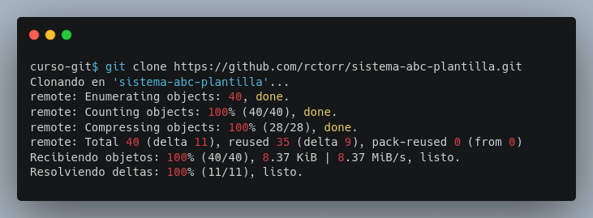
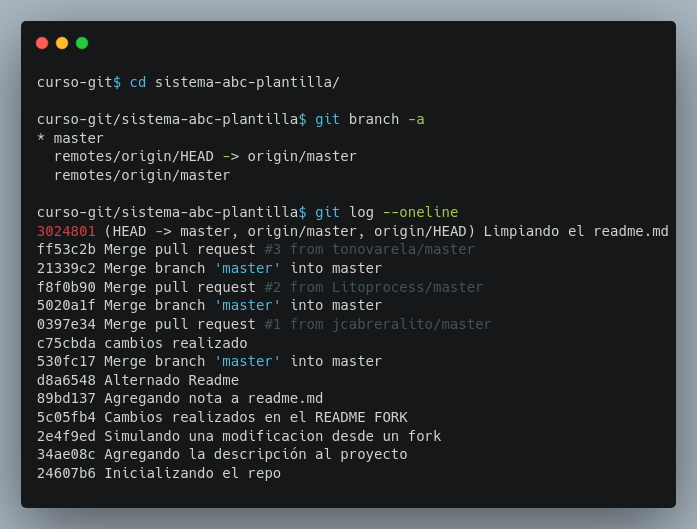
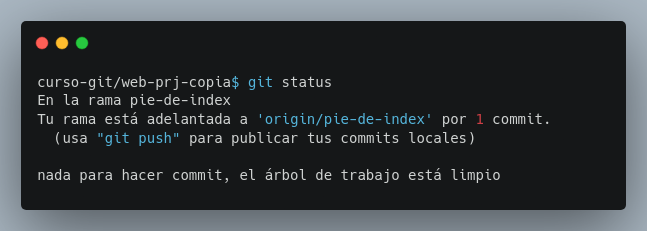
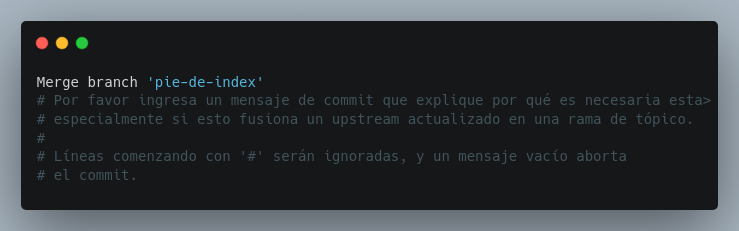

## Módulo 8: Clonación y Obtención de Cambios (Fetching) - ¡Tu Propio Universo Git!

- Clonación de repositorios remotos y manejo de ramas.
- Incorporación de cambios y borrado de ramas.

Este módulo te guiará en el proceso de clonar un repositorio remoto y obtener los cambios más recientes.  Aprenderás a manejar ramas en un repositorio clonado y a integrar cambios de un repositorio remoto a tu repositorio local.


### 8.1 Clonación de Repositorios Remotos y Manejo de Ramas: ¡Una Copia Fresca!

La clonación es el proceso de crear una copia local completa de un repositorio remoto.  Es ideal para empezar a trabajar en un proyecto, colaborar con otros o tener un respaldo local.  El comando `git clone` realiza esta magia. Al clonar, se crea una copia local con todas las ramas, commits y archivos del repositorio remoto.  Además, se configura automáticamente un vínculo ("upstream") entre tu repositorio local y el remoto, con el nombre corto `origin`. Este nombre corto simplifica la interacción con el repositorio remoto usando comandos como `git fetch` y `git push`.


**Desarrollo**

**Paso 0: Preparación:**  Asegúrate de tener tu terminal abierta y de tener la URL del repositorio remoto `sistema-abc-plantilla` en GitHub.

```https://github.com/rctorr/sistema-abc-plantilla/tree/master```

**Paso 1: Clonando el repositorio (`git clone`):** Asegurate de estar en la carpeta `curso-git` posiblemente debas ejecutar el comando `cd ..` y entonces obten la URL para clonar el repo desde la página de Github usando HTTPS y usala en el siguiente comando:

```bash
cd ..
git clone <URL_de_web-prj-remote>
```



Ahora ya contamos con la copia del proyecto **sistema-abc-plantilla**, entonces se puede cambiar a la carpeta del proyecto y revisar la lista de ramas o ver el histórico de confirmaciones.

```bash
cd sistema-abc-plantilla
git branch -a
git log --oneline
```




**Paso 1: Clonando el repositorio existente (`git clone`):**  Vamos a clonar el repositorio del proyecto remoto `web-prj-remote` en un nuevo directorio usando la URL de tipo SSH:

```bash
cd ..
git clone git@github.com:ritodev-tech/web-prj-remote.git web-prj-copia
```

Esto creará un directorio llamado `web-prj-copia` con una copia exacta de `web-prj-remote`.

**Paso 2: Navegando al directorio clonado:**  Cambia al directorio recién creado:

```bash
cd web-prj-copia
```

**Paso 3: Verificando la conexión remota (`git remote -v`):**   El comando `git clone` configura automáticamente la conexión remota con el nombre corto `origin`.  Verifica esto con:

```bash
git remote -v
```

**Paso 4: Verificando ramas (`git branch -a`):**  Observa las ramas locales y remotas con:

```bash
git branch -a
```

Verás la rama `master` local (a la que apunta `HEAD`), y las ramas remotas de seguimiento `origin/main` y `origin/pie-de-index`.


**Paso 5: Cambiando a una rama remota (`git switch --track`):**  Para trabajar en la rama remota `pie-de-index`, cambia a la rama de seguimiento remoto:

```bash
git switch --track origin/pie-de-index
```

Esto creará automáticamente una rama local `pie-de-index` basada en la rama remota `origin/pie-de-index` y lo puedes comprobar con el comando `git branch -a`.

**Paso 6:  Realizar un commit en la rama local:** Añade el número telefónico de contacto al pié de página del archivo `index.html` y haz `git add index.html` y `git commit -m "Añadiendo teléfono de contacto a pie de index"`.

El código HTML del pié de página quedaría de la siguiente forma:

```html
	<footer>
		© All rights reserved. The Inventor's House, 2024.
		<a href="https://theinventorhouse.org/">
			theinventorhouse.org
		</a>
		<p>Tel: 55 1234 5678</p>
	</footer>
```

**Paso 7: Revisando estado del repo (`git status`):** Ejecuta el comando `git status` y observa como hay un commit en el repo local que no está en el repo remoto, esto es gracias al seguimiento entre rama local y remota que hace git.



**Paso 7: Enviar los cambios (`git push origin pie-de-index`):**  Envía tus cambios a la rama remota `origin/pie-de-index` en `web-prj-remote`:

```bash
git push origin pie-de-index
```


### 8.2 Incorporación de Cambios y Borrado de Ramas: ¡Sincronización y Limpieza!

Después de clonar un repositorio, es posible que haya cambios nuevos en el repositorio remoto. Para obtener estos cambios, usamos `git fetch`.  `git fetch` descarga los cambios del repositorio remoto a tu repositorio local, actualizando las ramas de seguimiento remoto (`origin/main`, `origin/pie-de-index`, etc.).  Para integrar esos cambios en tus ramas locales, utilizas `git merge`.  Finalmente, una buena práctica es mantener tu repositorio limpio eliminando ramas que ya no necesitas usando `git branch -d <nombre_de_rama>`.


**Desarrollo**

**Paso 0: Preparación:**  Debes tener tu terminal abierta en el directorio `web-prj`.  Recuerda que  `web-prj` es la carpeta original del proyecto y que has hecho un nuevo commit en la rama `pie-de-index` desde el proyecto de la carpeta `web-prj-copia`.


**Paso 1: Obtener cambios remotos (`git fetch`):**  Descarga los últimos cambios del repositorio remoto:

```bash
git fetch origin
```

**Paso 2: Verificar cambios (`git log` y `git branch -a`):**  Utiliza `git log` y `git branch -a` para ver el estado del repositorio local.  Observa que la rama `origin/pie-de-index` ahora apunta al nuevo commit, mientras que la rama local `pie-de-index` no lo hace.


**Paso 3: Fusionar cambios (`git merge`):**  Integra los cambios en la rama local `pie-de-index`:

```bash
git merge origin/pie-de-index
```

Si es una fusión *fast-forward*, la rama `pie-de-index` local se actualizará directamente. De lo contrario, se creará un nuevo commit de fusión.


**Paso 4: Verificar el resultado (`git log`):**  Confirma que tu rama `pie-de-index` local esté actualizada usando `git log`.

**Paso 5: Fusiona todo en la rama `master` (`git merge`):** Recuerda primero estar en la rama `master` y luego usar el comando `git merge pie-de-index`. Valida con `git log` y visualmente el archivo `index.html` que debería contener la información del pié de página.



**Nota**: El merge abre un editor solicitando revisar si el mensaje para el commit es correcto (generalmente lo es), así que para confirmar hay que guardar el contenido y salir del editor, ya hablaremos de la fusión a tres pasos más adelante.

**Paso 6: Eliminar la rama (opcional):**  Si ya no necesitas la rama `pie-de-index`, puedes eliminarla localmente.  Recuerda que antes debes asegurarte de que cualquier cambio en la rama `pie-de-index` ya ha sido fusionado en la rama `master`.

```bash
git branch -d pie-de-index
```

**Paso 7: Eliminar ramas remotas (`git push origin -d pie-de-index`):**  Para eliminar la rama `origin/pie-de-index` remota del repositorio `web-prj-remote` (y la rama de seguimiento remoto en tu repositorio local):

```bash
git push origin -d pie-de-index
```

Este módulo te ha guiado a través de la clonación, obtención de cambios y gestión de ramas en un repositorio remoto.  La clonación es un paso fundamental en la colaboración, y  entender `git fetch` y `git merge` te permitirá mantener tus repositorios sincronizados.

Recuerda siempre realizar `git fetch` antes de fusionar para evitar posibles conflictos y sorpresas.  Mantener tus ramas organizadas y eliminar las que ya no se usan es fundamental para una gestión eficiente de tus repositorios.


