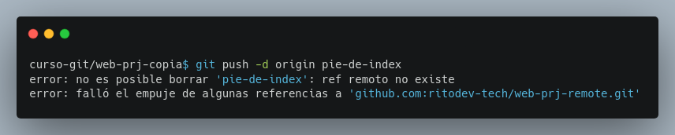
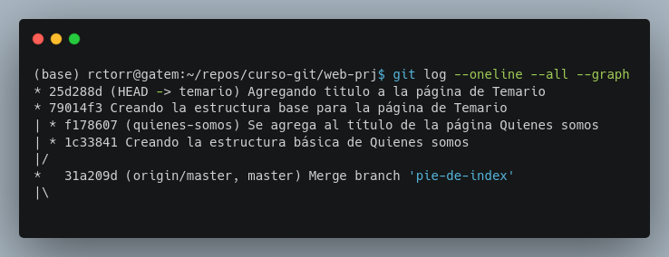
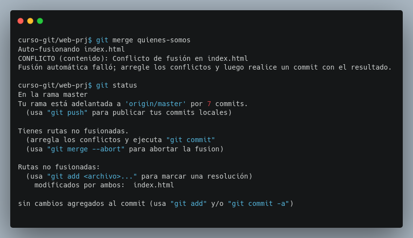

## Módulo 9: Fusiones de Tres Vías - ¡Resolviendo Conflictos con Estilo!

- Importancia y configuración de fusiones de tres vías.
- Manejo de archivos modificados y colaboración.

Este módulo te adentrará en el mundo de las fusiones de tres vías, esenciales cuando los historiales de tus ramas han divergido. Aprenderás a manejarlas con soltura y a colaborar eficientemente, incluso cuando surgen conflictos.

### 9.1 Importancia y Configuración de Fusiones de Tres Vías: ¡Cuando los Caminos se Cruzan!

Las fusiones *fast-forward* son geniales cuando el historial de tus ramas es lineal.  Pero, ¿qué ocurre cuando dos ramas han evolucionado independientemente y tienen commits únicos?  Ahí entran en juego las fusiones de tres vías.  Son más complejas que las *fast-forward*, pero son cruciales para la colaboración. Una fusión de tres vías crea un nuevo commit que combina los cambios de ambas ramas, incluso cuando esos cambios modifican las mismas partes de un archivo (produciendo un *conflicto de fusión*).  Git te ayudará a resolver estos conflictos, ¡pero necesitas saber cómo hacerlo!

**Desarrollo**

**Paso 0: Preparación:**  Asegúrate de tener tu repositorio local `web-prj` sincronizado con el repositorio remoto `web-prj-remoto`.

En el repo `web-prj-remoto` es necesario actualizar los cambios realizados en `web-prj`:

```bash
git fetch
git log --oneline --all
git merge
git log --oneline --all
git branch -d pie-de-index
git push -d origin pie-de-index
```



Cuando se intenta borrar una rama que ya no existe en el repo remoto es necesario actualizar la lista de ramas remotas con el siguiente comando:

```bash
git remote update origin --prune
git branch -a
```

**Paso 0: Preparación:** Regresamos a nuestro proyecto `web-prj` en éste momento sólo debería de existir la rama `master` local y también remoto, si no fuera así realiza las migraciones necesarias hacia la rama `master` y elimina todas las ramas adicionales.

**Paso 2: Simulando la divergencia:** Ahora tenemos un nuevo requerimiento, crear la página `temario.html`, para ello creamos una nueva rama llamada `temario` y creamos nuestra primer tarea que consiste en crear la estructura básica de la página.

```bash
git checkup -b temario
```
Y en el editor creamos el archivo `temario.html` con el siguiente contenido (que puedes obtenerlo desde el archivo `index.html`)

```html
<!DOCTPYE html>
<html>
<head>
	<title>Trabajando con GIT:: Temario</title>
</head>
<body>
	<header>
		<a href="index.html">Inicio</a> |
		<a href="temario.html">Temario</a> |
		<a href="quienes-somos.html">Quienes somos</a>
		<a href="contacto.html">Contacto</a>
	</header>
	<div class="contenido">
	</div>
	<footer>
		© All rights reserved. The Inventor's House, 2024.
		<a href="https://theinventorhouse.org/">
			theinventorhouse.org
		</a>
		<p>Tel: 55 1234 5678</p>
	</footer>
</body>
</html>
```
Y agrega el archivo al repo, ya sabes como cierto!

**Paso 3: Simulando la divergencia:** También agregamos un título a la página `temario.html` y creamos un commit más.

**Paso 4: Simulando la divergencia:** Ahora nos solicitan crear también la página de `quienes-somos.html` con dos tareas a realizar:

- Crear la estructura básica de la página Quienes somos
- Agregar un título a la página Quienes somos

y realizar una confirmación por cada tarea, pero hay que crear una nueva rama `quienes-somos` partiendo de la rama `master`.

**Paso 5: Verificar la divergencia (`git log --graph --oneline --decorate`):**  Utiliza el siguiente comando para visualizar el historial de commits:

```bash
git log --graph --oneline --all
```


Observa que el historial ha divergido: las ramas local `temario` y `quienes-somos` apuntan a diferentes commits que no se pueden alcanzar siguiendo una sola línea de tiempo.

**Paso 6: Fusionando fast-forward (`git merge temario`):**  Ahora, intenta fusionar la rama `temario` con tu rama `master` local.  Este es un escenario ideal para probar una fusión de dos vías:

Git detectará automáticamente que se trata de una fusión de dos vías.

**Paso 5: Fusionando de 3 vías:** Ahora, intenta fusionar la rama `quienes-somos` con tu rama `master` local.  Este es un escenario ideal para probar una fusión de tres vías:

Git detectará automáticamente que se trata de una fusión de tres vías y abrirá el editor para crear el mensaje de un nuevo commit, simplemente guarda el contenido y sal del editor.

**Paso 6: Verificando el historial (`git log --graph --oneline --all`):**  De nuevo, `git log --graph --oneline --all` te mostrará el nuevo commit de fusión y cómo ha unido los historiales divergentes.  Observa que el nuevo commit tiene dos padres.


### 9.2 Manejo de Archivos Modificados y Colaboración: ¡Trabajando Juntos!

Las fusiones de tres vías pueden generar *conflictos de fusión* cuando se realizan cambios en las mismas partes de un archivo en ramas diferentes.  Git te avisará de estos conflictos.  Necesitarás editar manualmente los archivos afectados para resolver el conflicto y marcar la resolución como "resolvido" para Git.


**Desarrollo**

**Paso 0: Preparación:**  Asegúrate de tener tu repositorio `web-prj` en el mismo estado que al final de la sección anterior.

**Paso 1: Simulando un conflicto:**  Estando en la rama `temario` se solicita agregar un línk a la página `temario.index` en el contenido de la página `index.html`, así que modificar el archivo `index.html` y crea un commit con los comabios.

**Paso 2: Simulando un conflicto:** Ahora estádo en la rama `quienes-somos` se solicita agrega un link a la página `quienes-somos.html` en el contenido de la página `index.html`, modificar el archivo `index.html` con los cambios y crea un commit.

**Paso 3: Simulando un conflicto:** Ahora realizamos la primera fusión de la rama `temario` hacia la rama `master` (¿debería ser una fusión fast-forward?)

**Paso 4: Intento de fusión:** Intenta fusionar la rama `quienes-somos` en la rama `master`.  Se producirá un conflicto de fusión. Usando `git status` te indicará cuáles son los archivos en conflicto.



**Paso 5: Resolver el conflicto:**  Abre el archivo en conflicto (`index.html`) con tu editor de texto.  Verás marcadores especiales que Git ha añadido para indicar el comienzo y el final de la sección conflictiva. Edita el archivo manualmente para resolver el conflicto.  Cuando hayas terminado, elimina las marcas que Git añadió.

Los conflictos de fusión se manifiestan mediante marcadores especiales dentro de los archivos afectados:

* `<<<<<<< HEAD`:  Marca el inicio de la sección conflictiva de la rama de destino.
* `=======`: Separa el contenido de la rama de destino del contenido de la rama de origen.
* `>>>>>>> <nombre_rama>`: Marca el final de la sección conflictiva de la rama de origen.

Para resolver un conflicto, debes:

1. **Entender el conflicto:**  Lee el contenido de cada sección para comprender los cambios conflictivos.
2. **Editar el archivo:**  Modifica el archivo para integrar los cambios de manera que tenga sentido en el contexto del proyecto.  Elimina los marcadores de conflicto (`<<<<<<<`, `=======`, `>>>>>>>`).
3. **Añadir al área de preparación (`git add`):** Usa `git add <archivo>` para indicar que has resuelto el conflicto.
4. **Confirmar los cambios (`git commit`):**  Realiza un commit con un mensaje que describe la resolución del conflicto.


**Paso 6: Marcar el archivo como resuelto (`git add index.html`):**  Después de resolver el conflicto, usa `git add` para marcar el archivo como resuelto:

```bash
git add index.html
```

**Paso 7: Realizar un commit de fusión (`git commit`):**  Ahora, realiza un nuevo commit para registrar la resolución del conflicto.  Se te pedirá que escribas un mensaje de commit que explique la resolución.  Guárdalo en Vim (con `:wq`).

**Paso 8: Verificación del resultado (`git log`):**  Confirma que la fusión se realizó correctamente usando `git log`.  Observa el commit de fusión y cómo se han integrado los cambios.

**Reto: Actualizando ramas `temario` y `quienes-somos`** Piensa en una estrategia para hacer que las ramas `temario` y `quienes-somos` tengan los mismos cambios que tiene la rama `master`. Ejecuta los comando que consideres necesarios.

**Nota: No olvides actualizar tu repo remoto** Posiblemente quieras ejecutar `git push origin --all` revisa con `git branch -a`.

**Abortando una Fusión (`git merge --abort`):** Si en algún momento decides abortar una fusión, puedes usar este comando:

```bash
git merge --abort
```
Esto restablecerá tu repositorio al estado anterior a la fusión.

Este módulo te ha proporcionado una comprensión profunda de las fusiones de tres vías, incluyendo el manejo de conflictos.  Recuerda que la clave para una colaboración exitosa es una comunicación clara y la anticipación de posibles conflictos.  

