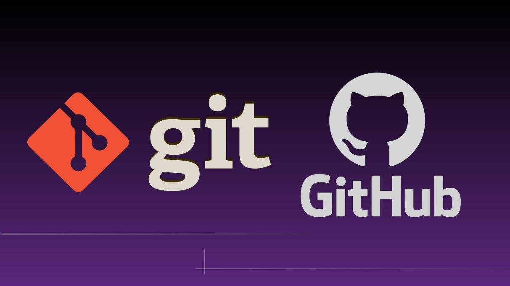

**The Inventor House presenta:**

# Curso: Trabajando con Git

## Instructor:

- Ricardo Torres
- Email: rictor [at] cuhrt.com
- Github: https://github.com/rctorr
- Twitter: https://twitter.com/rctorr
- Lenguajes: Python, Javascript, HTML, CSS, SQL, PHP, C, Java

## Objetivo del curso:

Este curso enseña Git de manera simple, visual y tangible para que puedas construir un modelo mental sólido de cómo funciona el control de versiones. A través del uso de narrativas y ejercicios prácticos, aprenderás a usar esta herramienta con confianza. La información se introduce de manera incremental para que no te sientas abrumado con términos o conceptos desconocidos.

Aprender Git es ideal para cualquiera que necesite usar Git para proyectos personales o profesionales: estudiantes de bootcamps de programación, desarrolladores junior, profesionales de datos y redactores técnicos, por mencionar solo algunos.

**Duración del curso:** 16 horas

## Objetivos de aprendizaje:

Al completar este curso, habrás adquirido los conocimientos y habilidades necesarios para:

* Descargar Git e inicializar un repositorio local.
* Agregar archivos al área de preparación y hacer commits.
* Crear, cambiar y eliminar ramas.
* Fusionar y rebasear ramas.
* Trabajar con repositorios remotos, incluyendo clonación, envío (push), extracción (pull) y recuperación (fetch).
* Usar pull requests para colaborar con otros.

## Contenido del curso:

- [**Módulo 1: Git y la línea de comandos**](modulo_01.md)
- [**Módulo 2: Repositorios locales**](modulo_02.md)
- [**Módulo 3: Realización de commits**](modulo_03.md)
- [**Módulo 4: Ramas**](modulo_04.md)
- [**Módulo 5: Fusión (Merging)**](modulo_05.md)
- [**Módulo 6: Servicios de hosting y autenticación**](modulo_06.md)
- [**Módulo 7: Creación y envío a un repositorio remoto**](modulo_07.md)
- [**Módulo 8: Clonación y obtención de cambios (Fetching)**](modulo_08.md)
- [**Módulo 9: Fusiones de tres vías**](modulo_09.md)
- [**Módulo 10: Rebase**](modulo_10.md)
- [**Módulo 12: Pull requests (Merge requests)**](modulo_10.md)

**Repositorio:**

- [https://github.com/rctorr/Trabajando-con-Git](https://github.com/rctorr/Trabajando-con-Git)

